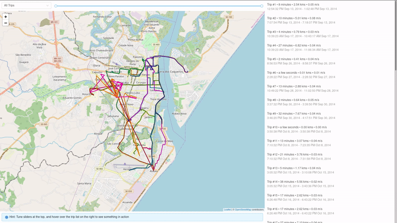
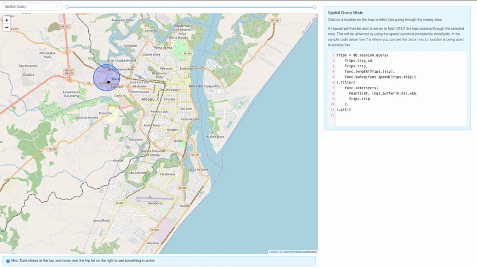

# MobilityDB-SQLAlchemy Demo





This is a demo app for [mobilitydb-sqlalchemy](https://github.com/adonmo/mobilitydb-sqlalchemy). We are using [GPS Trajectories Data Set](https://archive.ics.uci.edu/ml/datasets/GPS+Trajectories) available on UCI Machine Learning Repository to tinker around with our library.

Like most webapps, the demo is structured into a frontend part and a backend part, along with the database (postgres+mobilitydb). All three can be run at once using docker-compose, as described in more detail below.

In this demo, you can:

 * See how an SQLAlchemy model can be defined with a column type defined in mobilitydb using [mobilitydb-sqlalchemy](https://github.com/adonmo/mobilitydb-sqlalchemy). (see `models.py`)
 * See how queries can be run over these models, with usage of functions defined in mobilitydb included. (see `main.py`)
 * Additionally, examples for serializing trajectory data using the python library [trajectory](https://github.com/adonmo/trajectory). (see `main.py`)
 * Finally, examples for deserializing trajectory data in the browser using the javascript library [trajectory.js](https://github.com/adonmo/trajectory). (see `api.js`)

## Running demo locally

Most of the local deployment logic is handled by docker-compose. So you can simply run:

```
docker-compose up --build
```

The app should now be live at http://localhost:7332

Although you wouldn't need to interact directly with backend and the database instance, they should be running on ports 7331 and 25432 respectively.

### Loading the data

Once the app is up, you will notice that you won't see any data. This is because you need to populate it for the first time you are running the demo, by running:

```
docker-compose run backend python populate_data.py
```
